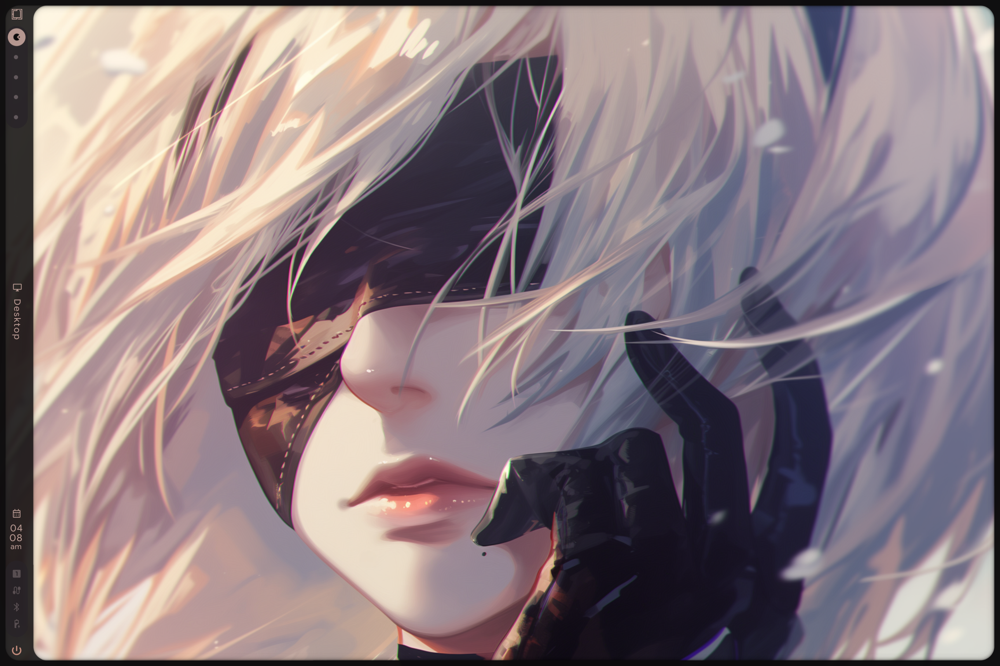
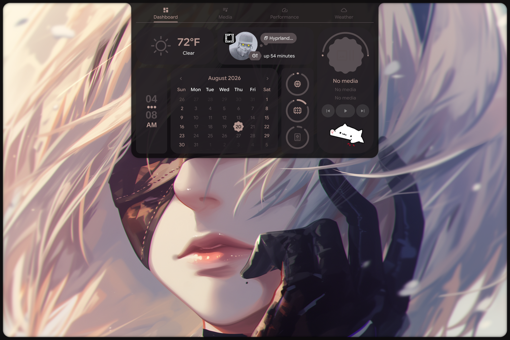
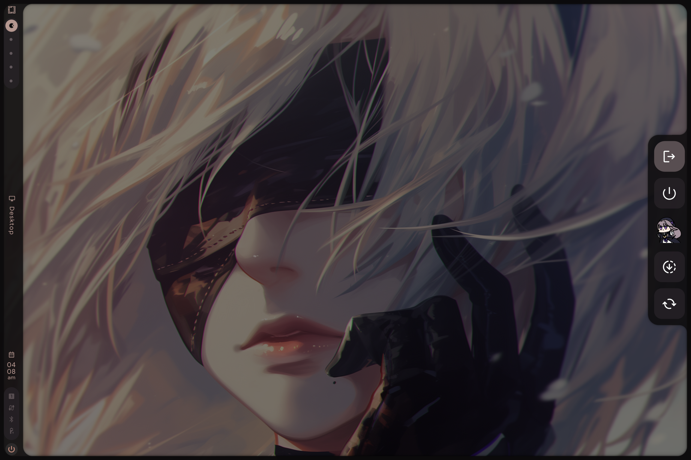

# omartia-dots-remux

Drop-in replacement for omarchy-shell (quattro bar) with **Caelestia Shell** — keeps omarchy's theme switching working via a color bridge.





[Preview video](previewvideo.mp4)

## What this does

- **Replaces** omarchy-shell (bar, notifications, OSD, menu) with Caelestia Shell
- **Bridges** omarchy themes → Caelestia's Material Design 3 color system
- **Keeps** all omarchy keybindings, workspace management, and theme switching
- **Recreates** the removed omarchy menus as a themed **fuzzel menu suite**

## What you get

| Feature | Source |
|---|---|
| Status bar | Caelestia Shell |
| Lock screen | Caelestia Shell (animated) |
| App launcher | Caelestia Shell (Super+Space) |
| Dashboard | Caelestia Shell (media, weather, stats) |
| OSD (volume/brightness) | Caelestia Shell |
| Menus (root/power/keybinds/themes/packages/update/config/defaults/restart) | Fuzzel suite (`omartia-*`), themed from the live Caelestia scheme |
| Theme switching | `omarchy-theme-set` (native, works as before) |
| Window management | Omarchy keybindings (unchanged) |
| Update resilience | `omarchy-update` can't resurrect omarchy-shell |
| Install safety net | Preflight verifies the login chain before logout; auto-rollback to stock Omarchy on failure |

## Quick install

```bash
git clone https://github.com/deoxizn/omartia-dots-remux.git
cd omartia-dots-remux
./install.sh
```

Use `./install.sh -y` to skip confirmation prompts.

**Test first without making changes:**
```bash
./install.sh --dry-run
```

**Already running the remux?** Don't reinstall — just upgrade:
```bash
./upgrade.sh
```
This pulls the latest repo, refreshes the menu scripts / theme bridge hook /
update guard in place, 3-way-merges lua config changes into your live files
(personal edits preserved; conflicts leave your file untouched with a
`.conflict` copy for manual resolution), keeps keybinds identical to the repo
via a managed block at the end of `bindings.lua` (legacy auto-injected blocks
are stripped automatically — duplicates made toggle binds fire twice and look
dead), and enforces the SDDM-safe `omarchy-system-logout`.
`monitors.lua` / `input.lua` are never touched (device-specific); everything
else is reported as drift. Add `--dry-run` to preview, or `--adopt-lua` to
adopt repo versions of lua files that have no merge history (yours is backed
up first).

The installer will:
1. Install build dependencies (cmake, ninja, qt6, etc.)
2. Build and install Caelestia Shell from source
3. Backup your existing configs
4. Copy the new configs (skips hypr files that already exist)
5. Patch `hyprland.lua` to disable omarchy's default autostart (via Lua `package.loaded`, injected after Omarchy's bootstrap — survives pacman updates and config reloads)
6. Patch `autostart.lua` to launch Caelestia Shell and take over the non-shell parts of Omarchy's autostart (monitor watch, automount, post-boot hooks)
7. Set up the systemd service (auto-restart on crash)
8. Set up the theme bridge hook
9. Install the omarchy-update guard — `omarchy-update` ends with `omarchy-restart-shell`, which hard-relaunches omarchy-shell over Caelestia. The guard makes it exit early while Caelestia is running, and a libalpm hook re-applies it after every omarchy package upgrade
10. Install the omartia fuzzel menu suite to `~/.local/bin/`
11. Sync your current theme
12. Run the session-start preflight (see [Install safety net](#install-safety-net-preflight))
13. Auto-logout after 5 seconds — **only if every preflight check passed** (press Ctrl+C to cancel). Uses `omarchy-system-logout` (`uwsm stop`), so sddm-helper exits cleanly and the login screen returns instead of black-screening

## Install safety net (preflight)

Historically, switching to Caelestia could black-screen after logout on a fresh
install: the stub suppressed omarchy-shell, and if the injected launch handler
didn't survive upstream config changes, *nothing* started. The installer now
verifies the exact chain your **next login** depends on, before it ever offers
to log you out:

- `hyprland.lua` autostart stub is correctly placed (after Omarchy's bootstrap, before its defaults load)
- Omarchy still loads `hypr.autostart` and still ships the APIs the launch handler uses (`o.launch`, `hyprland.start`) — catches upstream layout drift on fresh installs
- `autostart.lua` registers the Caelestia launch handler and parses as valid Lua
- `caelestia-shell.service` exists, is enabled, points at a real binary, and passes `systemd-analyze --user verify`

**All checks pass** → normal logout prompt, Caelestia takes over.

**Any check fails** → automatic rollback instead of a dead session:

1. `hyprland.lua`, `autostart.lua`, `bindings.lua` restored from the backup taken at install start (injected blocks stripped surgically if no backup exists)
2. `caelestia-shell.service` disabled so stock omarchy-shell owns startup again

Your PC stays fully usable as stock Omarchy — logging out or rebooting is safe.
The terminal prints exactly which checks failed; everything, including what was
rolled back, lands in `~/omartia-preflight.log`. Send that file for help or hand
it to your AI agent, then fix and re-run `./install.sh` — or `./uninstall.sh`
to remove everything.

**Black screen anyway** (e.g. an install from before this existed)? Press
`Ctrl+Alt+F4` for a TTY, log in, then:

```bash
cat ~/omartia-preflight.log                     # see what's wrong
systemctl --user start caelestia-shell.service  # bring the shell back now
```

## After install

1. Edit `~/.config/hypr/monitors.lua` for your displays
2. Edit `~/.config/hypr/input.lua` for your keyboard
3. Log out and back in
4. Test: `SUPER+Space` (launcher), `SUPER+L` (lock), `omarchy-theme-set <theme>`

**Reinstalling?** Existing hypr configs (`hyprland.lua`, `autostart.lua`, `looknfeel.lua`, `monitors.lua`, `input.lua`, `bindings.lua`) are never overwritten — edit them directly or restore from backup at `~/.config/omartia-dots-remux-backup/`.

## Keybindings

| Binding | Action |
|---|---|
| `SUPER+Space` | Caelestia launcher (apps, wallpaper, schemes, system) |
| `SUPER+Alt+Space` | Omartia root menu |
| `SUPER+Escape` | Power menu (confirm guard on reboot/shutdown) |
| `SUPER+Return` | Terminal |
| `SUPER+Shift+Return` | Browser |
| `SUPER+Shift+F` | File manager |
| `SUPER+Shift+N` | Editor |
| `SUPER+K` | Keybinding list (fuzzel) |
| `SUPER+Q` | Close window |
| `SUPER+1-0` | Switch workspace |
| `SUPER+Arrow` | Move/resize windows |
| `PRINT` | Screenshot |

## Menu suite

The omarchy-shell menus are recreated as standalone fuzzel scripts in
[`scripts/`](scripts/) (installed to `~/.local/bin/`). All of them are themed
from the live Caelestia scheme via the shared `omartia-fuzzel` wrapper, so
they restyle automatically on every theme switch. Esc navigates back one menu
level.

| Script | Purpose |
|---|---|
| `omartia-menu` | Root menu: Keybindings, Themes, Packages, Update, Config, Defaults, Restart, Session |
| `omartia-power` | Lock, logout, suspend, hibernate, reboot, shutdown (destructive actions require Confirm) |
| `omartia-keybinds` | Searchable keybinding list that dispatches binds (`--menu` for Esc-back) |
| `omartia-themes` / `omartia-themes-list` | Theme switcher with preview thumbnails + git theme install |
| `omartia-pkgs` | Package TUI launcher: install, remove, AUR |
| `omartia-update` | System/theme/firmware updates + package channel switcher |
| `omartia-config` | Edit `~/.config/hypr/*.{lua,conf}` in your default editor |
| `omartia-defaults` | Default browser/editor/terminal/agent pickers (includes installed beta/nightly browsers) |
| `omartia-restart` | Reload Hyprland, restart terminal/Caelestia shell, refresh theme |
| `omartia-fuzzel` | Shared fuzzel wrapper — reads colors from `~/.local/state/caelestia/scheme.json` |

## Uninstall

```bash
./uninstall.sh
```

Restores all backed-up configs, stops and removes the Caelestia Shell systemd service, and removes Caelestia Shell configs (including the update guard — which also self-neutralizes once Caelestia is no longer running). Log out/in to restore omarchy-shell.

## How the theme bridge works

```
omarchy-theme-set <name>
  → generates ~/.local/state/omarchy/current/theme/colors.toml
  → hook fires: caelestia-sync.sh
  → reads colors.toml, maps to M3 tokens
  → writes ~/.local/state/caelestia/scheme.json
  → Caelestia Shell auto-reloads (FileView watcher)
```

Any omarchy theme works automatically. No per-theme configuration needed.

## Requirements

- Arch Linux (or Arch-based distro)
- Omarchy 4.0 (quattro) installed
- Quickshell (`qs` or `quickshell` in PATH)
- cmake, ninja, base-devel (installer handles these and other deps)
- AUR helper (yay or paru) for libcava, caelestia-cli

## Credits

- [Omarchy](https://github.com/basecamp/omarchy) — window manager, theme system, keybindings
- [Caelestia Shell](https://github.com/caelestia-dots/shell) — desktop shell, lock screen, launcher
- Original [omartia-dots](https://github.com/Z-Rh0/omartia-dots) — inspiration for combining both
