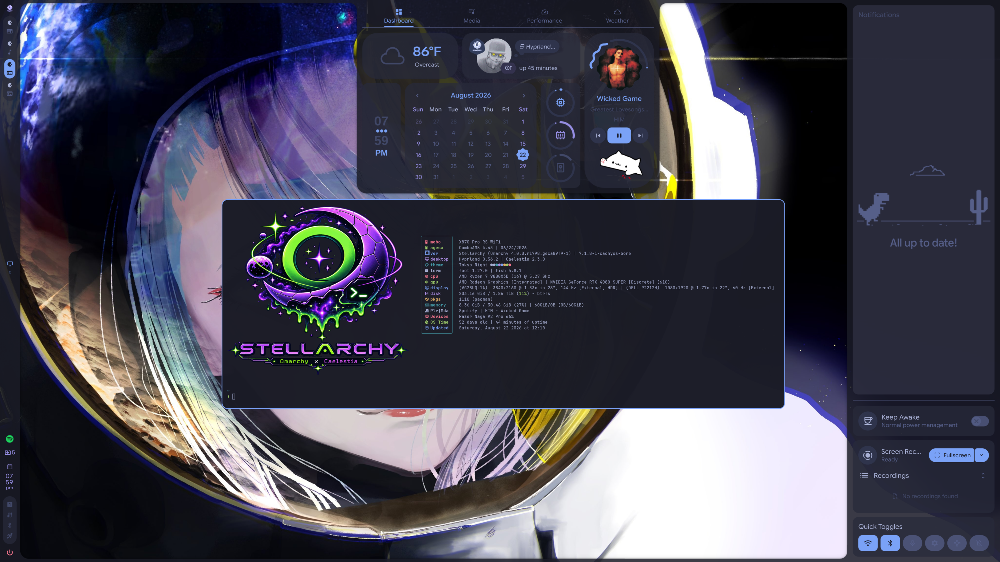
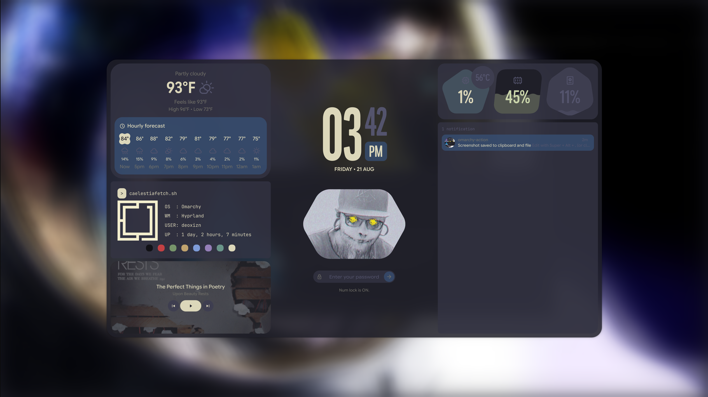

> **PSA:** This project is now considered **stable** and is no longer in active development. Updates will only be made if issues arise.

<div align="center">


[stellarchy.dirty.pizza](https://stellarchy.dirty.pizza)

</div>

<p align="center">
  <a href="CHANGELOG.md">CHANGELOG</a>&nbsp;&nbsp;|&nbsp;&nbsp;
  <a href="#read-this-first">Read First</a>&nbsp;&nbsp;|&nbsp;&nbsp;
  <a href="#install">Install</a>&nbsp;&nbsp;|&nbsp;&nbsp;
  <a href="#upgrading-an-existing-install">Upgrading</a>&nbsp;&nbsp;|&nbsp;&nbsp;
  <a href="#stellarchy-branding">Branding</a>&nbsp;&nbsp;|&nbsp;&nbsp;
  <a href="#keybindings">Keybinds</a>&nbsp;&nbsp;|&nbsp;&nbsp;
  <a href="#menu-suite">Menu Suite</a>&nbsp;&nbsp;|&nbsp;&nbsp;
  <a href="HiddenCommands.md">Hidden Menu</a>&nbsp;&nbsp;|&nbsp;&nbsp;
  <a href="#uninstall">Uninstall</a>
</p>

<p align="center">
  
</p>
<p align="center">
  
</p>

[Preview video](previewvideo.mp4)

<br><br>

<a id="read-this-first"></a>

```
▄▖     ▌ ▄▖▌ ▘   ▄▖▘    ▗
▙▘█▌▀▌▛▌ ▐ ▛▌▌▛▘ ▙▖▌▛▘▛▘▜▘
▌▌▙▖█▌▙▌ ▐ ▌▌▌▄▌ ▌ ▌▌ ▄▌▐▖
```

**This is not a theme or a plugin — it is a shell replacement.** It removes
`omarchy-shell` from your system and rebuilds everything that depended on it.
That means some things you may use daily in stock Omarchy **stop existing**
until something replaces them: keybindings routed into `omarchy-shell` become
silent no-ops, its menus and lock screen disappear, and the idle path changes.
This repo rebinds or replaces every dead path it can, but expect Omarchy to
*not* behave stock out of the box — if you want stock behavior with a
different bar, this remux is not that.

Quattro plugins are part of that: plugin support lived inside `omarchy-shell`
itself, so bar widgets, panels, overlays, menus and services from
`~/.config/omarchy/plugins/` have nothing to load into after install.
Caelestia has a fixed module set and no plugin loader — if you depend on an
omarchy-shell plugin, stay on stock Omarchy.

### What happens to stock Omarchy parts

Highlights only; the full 15-row compatibility matrix lives at
[stellarchy.dirty.pizza](https://stellarchy.dirty.pizza):

| Stock Omarchy | In stellarchy | Replacement / notes |
|---|---|---|
| omarchy-shell (bar, notifications, OSD) | **Removed** | Caelestia Shell provides all three |
| omarchy-shell menus + lock screen | **Removed** | Fuzzel suite `stellarchy-*`; Caelestia session lock via `caelestia-system-lock` |
| Media keys / clipboard / emoji panels | **Rebound** | `stellarchy-media`, `caelestia clipboard`, `caelestia emoji` |
| Theme switching (`omarchy-theme-set`) | **Works as before** | A hook bridges each theme's colors.toml into Caelestia's M3 scheme live |
| Window management, workspaces, app binds | **Untouched** | Omarchy defaults |

Anything not listed here that shells out to `omarchy-shell` elsewhere in your
own scripts will also be dead — grep for it.

### What doesn't work like stock Omarchy

Honest list of the remaining gaps:

- **Per-notification actions are reduced**: no dismiss-single, no invoke-last,
  no notification history keybindings. Caelestia exposes only clear-all/DND.
- **No bar panel chords**: stock's `SUPER+CTRL+F1-F9` panel toggles have no
  Caelestia equivalent and are unbound.
- **Caelestia is a different shell**: bar layout, popouts, launcher UX,
  dashboard content and lock screen all behave like Caelestia, not quattro.
  Per-monitor config exists natively (`~/.config/caelestia/monitors/<SCREEN>/shell.json`).
- **Quickshell bugs ship with the shell**: the shell tracks Hyprland state via
  events that can be missed across suspend/multi-monitor transitions; this
  repo patches around the known drawer-killing staleness in
  [`patches/`](patches/). If Caelestia misbehaves after an upstream update,
  check whether a patch stopped applying (`install.sh` warns when so).
- **`omarchy-shell` IPC callers die**: any personal script calling
  `omarchy-shell <...>` needs porting to `qs -c caelestia ipc call ...`,
  `playerctl`, or the stellarchy suite.

<br><br>

<a id="install"></a>

```
▄▖    ▗   ▜ ▜   ▗ ▘
▐ ▛▌▛▘▜▘▀▌▐ ▐ ▀▌▜▘▌▛▌▛▌
▟▖▌▌▄▌▐▖█▌▐▖▐▖█▌▐▖▌▙▌▌▌
```

```bash
git clone https://github.com/deoxizn/stellarchy.git ~/.local/opt/stellarchy
cd ~/.local/opt/stellarchy
./install.sh
```

Use `./install.sh -y` to skip confirmation prompts, or `--dry-run` to preview everything without touching anything.

### What it does

- Build and install Caelestia Shell from source (all deps handled)
- Back up existing configs, then diff-check the main Hyprland lua files (`hyprland.lua`, `autostart.lua`, `looknfeel.lua`, `bindings.lua`): remux-owned ones are left alone, stock/unowned ones are backed up (`*.pre-install.bak`) and replaced with the repo versions — a fresh Omarchy ships all of them, so without this the documented keybinds and autostart would silently never land. `monitors.lua` / `input.lua` are device-specific and only ever created if missing
- Ask for monitor + GTK scale on first install (drives a scale-aware corner-rounding block in `looknfeel.lua`; `-y` takes detected defaults)
- Disable Omarchy's shell autostart (survives pacman updates and config reloads) and launch Caelestia instead via `autostart.lua` + an auto-restarting systemd service
- Set up the theme bridge hook, `caelestia-system-lock` and the managed `hypridle.conf`
- Own the idle/sleep stack: `autostart.lua` launches `hypridle`, and stock Omarchy's `omarchy-sleep-lock.service` is disabled (it calls omarchy-shell IPC that no longer exists here and holds a sleep-delay inhibitor). Caelestia's built-in idle timeouts (`shell.json`) act as backstop; uninstall hands locking back to the stock monitor
- Apply Caelestia patches idempotently ([`patches/`](patches/)) and install the omarchy-update guard (a libalpm hook re-applies it after every omarchy upgrade)
- Add a bar update indicator (dim when clean, count badge when repo/AUR updates are pending — click opens the updater); upgrades seed its `bar.entries` slot into existing `shell.json` configs
- Install an auto-sync hook into omarchy-update's post-update path: every system update pulls this repo and re-runs `sync.sh` when new commits exist (logged to `~/.local/state/stellarchy/repo-sync.log`, desktop-notified on failure) — older installs catch up once with `git pull && ./sync.sh`, then it stays current on its own
- Install the fuzzel menu suite + `stellarchy-media` (see [Menu suite](#menu-suite)) — including System → Kernel (CachyOS opt-in + boot-entry repair) and System → Splash (adopt/refresh the boot splash), replacing the old `upgrade.sh` flags — seed the fastfetch OS line, deploy branding art
- Set up the Stellarchy boot splash and rebuild the initramfs so it's live on next boot
- Sync your current theme
- Run the session-start preflight, then auto-logout after 5s if every check passed (Ctrl+C cancels) — logout uses `omarchy-system-logout` (`uwsm stop`) so the session ends cleanly

After logging back in: check `~/.config/hypr/monitors.lua` and `input.lua` match your displays/keyboard (they're only ever created if missing), then test `SUPER+Space` (launcher), `SUPER+Ctrl+L` (lock) and `omarchy-theme-set <theme>`.

### Session-start preflight (safety net)

Before offering to log you out, the installer verifies the chain your next
login depends on: autostart stub placement, upstream API hooks, valid Lua
configs, that `autostart.lua` actually launches `hypridle` (and that the stock
sleep-lock monitor is disabled), and `caelestia-shell.service` health (enabled,
real binary, systemd-analyze clean).

**All checks pass** → normal logout prompt. **Any check fails** → automatic
rollback to fully usable stock Omarchy (configs restored from backup, service
disabled) instead of a dead session. Everything, including what was rolled
back, lands in `~/stellarchy-preflight.log` — send it for help or hand it to
your AI agent, then fix and re-run.

Caelestia didn't start after an older install? Press `Ctrl+Alt+F4` for a TTY,
log in, then:

```bash
cat ~/stellarchy-preflight.log                     # see what's wrong
systemctl --user start caelestia-shell.service     # bring the shell back now
```

<br><br>

<a id="upgrading-an-existing-install"></a>

```
▖▖         ▌▘
▌▌▛▌▛▌▛▘▀▌▛▌▌▛▌▛▌
▙▌▙▌▙▌▌ █▌▙▌▌▌▌▙▌
  ▌ ▄▌         ▄▌
```

```bash
./sync.sh          # apply current checkout to the install (the auto-sync hook runs this after pulling)
```

Your configs stay yours — lua updates merge in, conflicts never touch your files, and every replaced file is backed up in `~/.config/stellarchy-backup/`. Preview with `--dry-run`; `--adopt-lua` adopts repo lua versions that have no merge history (yours is backed up first).

Kernel and splash live in the menus: **System → Kernel** (CachyOS opt-in, boot-entry status & repair) and **System → Splash** (adopt/refresh the boot splash) under `SUPER+Alt+Space` — plain scripts (`stellarchy-kernel`, `stellarchy-splash`) if you prefer a terminal.

Kernel variants (Kernel menu), all prebuilt from chaotic-aur:

| Variant | Package | One-liner |
|---|---|---|
| `default` | `linux-cachyos` | EEVDF scheduler + CachyOS optimizations — the balanced choice |
| `bore` | `linux-cachyos-bore` | BORE scheduler — lowest latency under load; the gaming pick |
| `eevdf` | `linux-cachyos-eevdf` | Explicit EEVDF build (no CachyOS scheduler extras) |
| `lts` | `linux-cachyos-lts` | Long-term support kernel — fewest surprises |
| `rt-bore` | `linux-cachyos-rt-bore` | Real-time patches + BORE |

<br><br>

<a id="stellarchy-branding"></a>

```
▄        ▌▘
▙▘▛▘▀▌▛▌▛▌▌▛▌▛▌
▙▘▌ █▌▌▌▙▌▌▌▌▙▌
             ▄▌
```

The remux ships its own identity on top of Omarchy. What lands where:

| Touchpoint | New installs | Existing installs (`sync.sh` / menus) |
|---|---|---|
| Idle screensaver art | Installed | Installed if missing or still stock Omarchy art; **your own customization is never overwritten** |
| About logo (`about.txt`) | Installed | Same stock-detection rule |
| fastfetch OS line | If you have no own config, one is seeded from `/etc/fastfetch` with a commit-stamped `Stellarchy r<count>.<sha>` OS line; custom configs are untouched | Same |
| Boot splash | `stellarchy` plymouth theme set as default (Tokyo Night palette) | Opt-in via the Splash menu; afterwards kept refreshed automatically and re-applied to any kernel installed later (splash guard libalpm hook) |
| Script headers | Included | Synced with the menu suite |

Revert the splash anytime: `sudo plymouth-set-default-theme omarchy && sudo limine-mkinitcpio`.

The `stellarchy` splash theme vendors Omarchy's `omarchy.script` because
mkinitcpio's plymouth hook only packs the active theme's own directory — a
cross-dir `ScriptFile=` would ship an initramfs with no splash and an
invisible LUKS prompt (black screen). Install/upgrade refresh and verify the
vendored script on every run.

### CachyOS kernel (opt-in, post-install)

CachyOS kernels tune CPU scheduling — BORE for lowest latency under load (the
gaming pick), EEVDF default, plus LTS and real-time variants. Prebuilt from
[chaotic-aur](https://aur.chaotic.cx), so nothing compiles:

Pick a variant in the Kernel menu (or `stellarchy-kernel run <variant>`):
`default | bore | eevdf | lts | rt-bore`.

Adds `[chaotic-aur]` to `pacman.conf` (backed up first) and installs the
chosen kernel + headers (DKMS modules like NVIDIA rebuild automatically).
Limine's path-based `default_entry:` header follows the kernel by name, so it
survives snapshot churn. The stock Arch kernel is never removed — revert any
time via the Limine menu + one `default_entry:` edit. Full opt-out: remove the
`[chaotic-aur]` block from `/etc/pacman.conf`.

<br><br>

<a id="keybindings"></a>

```
▖▖    ▌ ▘   ▌
▙▘█▌▌▌▛▌▌▛▌▛▌▛▘
▌▌▙▖▙▌▙▌▌▌▌▙▌▄▌
    ▄▌
```

| Binding | Action |
|---|---|
| `SUPER+Space` | Caelestia launcher (apps, wallpaper, schemes) |
| `SUPER+Alt+Space` | Stellarchy root menu |
| `SUPER+N` | Caelestia sidebar / notifications shade |
| `SUPER+Alt+D` | Caelestia dashboard (media, weather, stats, network, BT) |
| `SUPER+Escape` | Power menu (confirm guard on reboot/shutdown) |
| `SUPER+Ctrl+L` | Lock via Caelestia (`caelestia-system-lock`) |
| `SUPER+Ctrl+P` | Session menu |
| `Media keys` | Play/pause, next, previous — any MPRIS player via `stellarchy-media` |
| `SUPER+Ctrl+V` / `SUPER+Ctrl+E` | Clipboard history / emoji picker |
| `SUPER+,` | Clear notifications |
| `SUPER+K` | Keybinding list (fuzzel) |

Everything else inherits from stock Omarchy — run `stellarchy-keybinds` for the
full searchable list. Stock's panel chords (`SUPER+Ctrl+A/B/W/Alt+D`) are
unbound; the dashboard on `SUPER+Alt+D` covers what they did.

<br><br>

<a id="menu-suite"></a>

```
▖  ▖       ▄▖  ▘▗
▛▖▞▌█▌▛▌▌▌ ▚ ▌▌▌▜▘█▌
▌▝ ▌▙▖▌▌▙▌ ▄▌▙▌▌▐▖▙▖
```

The omarchy-shell menus are recreated as standalone fuzzel scripts in
[`scripts/`](scripts/) (installed to `~/.local/bin/`). All of them are themed
from the live Caelestia scheme via the shared `stellarchy-fuzzel` wrapper, so
they restyle automatically on every theme switch. Esc navigates back one menu
level.

| Script | Purpose |
|---|---|
| `stellarchy-menu` | Root menu (alphabetized): Packages, Restart, Setup, System, Themes, Trigger, Update |
| `stellarchy-trigger` / `stellarchy-hardware` / `stellarchy-speedtest` | Hardware toggles gated on detected hardware (laptop display, hybrid GPU, touchpad...) + network/disk speed tests |
| `stellarchy-setup` / `stellarchy-network` / `stellarchy-security` | DNS picker + Wi-Fi QR code, and security setup (fingerprint/FIDO2/sshd/sudo) |
| `stellarchy-system` | Config editor, default app pickers, and the Kernel / Splash submenus |
| `stellarchy-kernel` | Opt into a prebuilt CachyOS kernel (default/bore/eevdf/lts/rt-bore) via chaotic-aur; Limine `default_entry:` follows by name — plus boot-entry status & repair |
| `stellarchy-splash` | Adopt or refresh the Stellarchy boot splash (verifies the theme is self-contained before any initramfs rebuild) |
| `stellarchy-power` | Lock, logout, suspend, hibernate, reboot, shutdown (destructive actions require Confirm) |
| `stellarchy-keybinds` | Searchable keybinding list that dispatches binds (`--menu` for Esc-back) |
| `stellarchy-themes` / `stellarchy-themes-list` | Theme switcher with preview thumbnails + git theme install |
| `stellarchy-pkgs` / `stellarchy-install` / `stellarchy-remove` | Packages → Install (package/AUR/web app) and Remove (package/web app/theme) submenus |
| `stellarchy-update` | Stellarchy system update, channel switcher, extra themes, Hyprsunset + hardware restarts, firmware |
| `stellarchy-config` | Edit `~/.config/hypr/*.{lua,conf}` in your default editor |
| `stellarchy-defaults` | Default browser/editor/terminal/agent pickers (includes installed beta/nightly browsers) |
| `stellarchy-restart` | Reload Hyprland, restart terminal/Caelestia shell, refresh theme |
| `stellarchy-media` | Universal MPRIS media control — targets whichever player is currently playing |
| `stellarchy-wifi-qr` | Renders the current Wi-Fi as a scannable QR in a floating terminal (replaces the removed shell widget) |
| `stellarchy-terminal` | Runs a command in a floating TUI.float terminal with logo/done polish (uniform app-id for all one-shot TUIs) |
| `caelestia-system-lock` | Lock via Caelestia + kb-layout reset + 1Password lock + delayed display-off (used by keybind, power menu and hypridle) |
| `stellarchy-fuzzel` | Shared fuzzel wrapper — reads colors from `~/.local/state/caelestia/scheme.json` |
| `stellarchy-version` | Prints the dots revision (`r<count>.<sha>`) shown on the fastfetch OS line |

<br><br>

<a id="uninstall"></a>

```
▖▖  ▘    ▗   ▜ ▜
▌▌▛▌▌▛▌▛▘▜▘▀▌▐ ▐
▙▌▌▌▌▌▌▄▌▐▖█▌▐▖▐▖
```

```bash
./uninstall.sh
```

Restores all backed-up configs, stops and removes the Caelestia Shell systemd service, reverts the `omarchy-restart-shell` guard patch, removes the bar-off toggle (restoring the stock bar), restores the stock plymouth splash, removes the SDDM theme, and cleans up all Stellarchy scripts, hooks, and state. Log out/in to restore omarchy-shell.

## Requirements

- Omarchy Quattro installed
- cmake, ninja, base-devel (installer handles these and other deps)

## Credits

- [Omarchy](https://github.com/basecamp/omarchy) — window manager, theme system, keybindings
- [Caelestia Shell](https://github.com/caelestia-dots/shell) — desktop shell, lock screen, launcher
- Original [omartia-dots](https://github.com/Z-Rh0/omartia-dots) — inspiration for combining both
